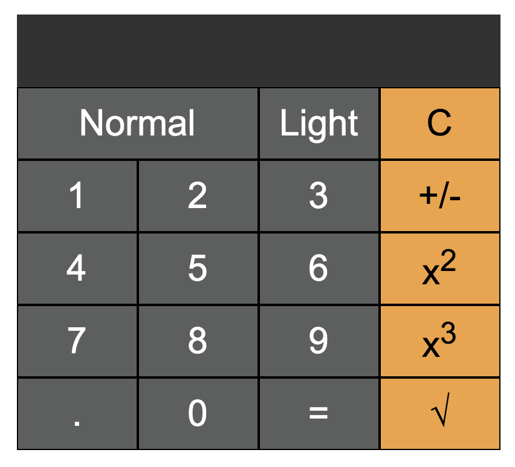

# react-calci-demo

[Edit on StackBlitz ⚡️](https://stackblitz.com/edit/react-calci-demo)

Inspired by https://github.com/niinpatel/calculator-react and added some new features.

React Simple Calculator: 

## New Features
1. Light Mode and Dark Mode 
2. Scientific mode and Normal Mode

